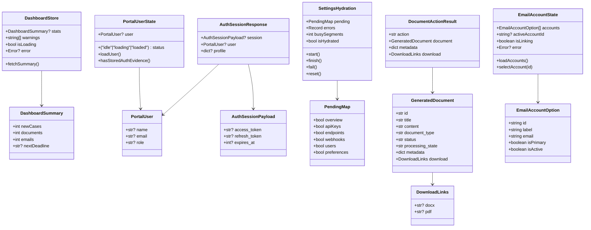

# AnwaltsAI Data Model

This document captures the current entities and relationships across the database schema, backend service models, and Nuxt UI data structures.

---

## 1. Database Schema ERD

Source schema: `scripts/init-db.sql` (+ migrations under `scripts/migrations/`).

```mermaid
erDiagram
    USERS ||--|| USER_PROFILES : "has profile"
    USERS ||--o{ TEMPLATES : "owns"
    USERS ||--o{ CLAUSES : "owns"
    USERS ||--o{ CLIPBOARD_ENTRIES : "stores"
    USERS ||--o{ DOCUMENTS : "creates"
    USERS ||--o{ ANALYTICS_EVENTS : "triggers"
    USERS ||--o{ ASSISTANT_MESSAGES : "posts"
    USERS ||--o{ API_TOKENS : "issues"
    USERS ||--o{ WEBHOOKS : "configures"
    USERS ||--o{ ORGANIZATION_SETTINGS : "last updated by"
    USERS ||--o{ EMAIL_ACCOUNTS : "links"
    USERS ||--|| USER_EMAIL_PREFERENCES : "active preference"
    EMAIL_ACCOUNTS ||--o| USER_EMAIL_PREFERENCES : "selected"
    WEBHOOKS ||--o{ WEBHOOK_LOGS : "emits"
    USERS {
        uuid id PK
        text email UNIQUE
        text name
        text role
        text password_hash
        timestamptz created_at
        boolean is_active
    }
    USER_PROFILES {
        uuid user_id PK FK
        jsonb data
        timestamptz updated_at
    }
    TEMPLATES {
        uuid id PK
        uuid user_id FK
        text title
        text content
        text category
        timestamptz created_at
        timestamptz updated_at
    }
    CLAUSES {
        uuid id PK
        uuid user_id FK
        text title
        text content
        text category
        text language
        timestamptz created_at
    }
    CLIPBOARD_ENTRIES {
        uuid id PK
        uuid user_id FK
        text content
        text type
        timestamptz created_at
    }
    DOCUMENTS {
        uuid id PK
        uuid user_id FK
        text title
        text content
        text type
        timestamptz created_at
    }
    ANALYTICS_EVENTS {
        uuid id PK
        uuid user_id FK NULLABLE
        text event_type
        jsonb data
        timestamptz created_at
    }
    ASSISTANT_MESSAGES {
        uuid id PK
        uuid conversation_id
        uuid user_id FK
        text role
        text content
        text model
        text message_hash
        timestamptz created_at
    }
    API_TOKENS {
        uuid id PK
        uuid user_id FK
        text token_hash
        text last4
        timestamptz expires_at
        timestamptz created_at
        timestamptz revoked_at
        timestamptz last_used_at
    }
    CALL_REQUESTS {
        uuid id PK
        text name
        text phone
        text email
        text message
        timestamptz created_at
    }
    ORGANIZATION_SETTINGS {
        uuid id PK
        text language
        text timezone
        boolean require_two_factor
        boolean enable_sso
        boolean password_min_length
        boolean password_require_special
        boolean password_require_numbers
        boolean email_notifications
        boolean browser_notifications
        boolean ai_updates
        text ai_model
        integer ai_creativity
        boolean auto_save
        timestamptz updated_at
        uuid updated_by FK NULLABLE
    }
    WEBHOOKS {
        uuid id PK
        text name
        text url
        text[] events
        text secret
        boolean is_active
        timestamptz created_at
        timestamptz updated_at
        uuid created_by FK NULLABLE
    }
    WEBHOOK_LOGS {
        uuid id PK
        uuid webhook_id FK
        integer status_code
        integer latency_ms
        text response_body
        timestamptz created_at
        text trace_id
    }
    EMAIL_ACCOUNTS {
        uuid id PK
        uuid user_id FK
        text provider
        text email_address
        text display_name
        text login_email_snapshot
        text link_source
        text refresh_token_encrypted
        text[] scopes
        boolean is_primary
        boolean oauth_consent
        boolean ai_read_consent
        boolean draft_only_mode
        timestamptz consent_timestamp
        timestamptz ai_consent_revoked_at
        timestamptz last_consent_update
        timestamptz linked_at
        timestamptz last_connected_at
        timestamptz revoked_at
        timestamptz updated_at
    }
    USER_EMAIL_PREFERENCES {
        uuid user_id PK FK
        uuid active_account_id FK NULLABLE
        timestamptz updated_at
    }
    API_REQUEST_METRICS {
        timestamptz bucket_start PK1
        text method PK2
        text path PK3
        integer request_count
        bigint total_latency_ms
        integer max_latency_ms
        integer success_count
        integer error_count
        integer last_status
        timestamptz last_seen_at
    }
    SERVICE_HEALTH_LOGS {
        uuid id PK
        text service_name
        boolean status
        integer latency_ms
        timestamptz checked_at
    }
```

### Notes
- `assistant_messages.conversation_id` groups chat turns without a dedicated conversations table.
- `organization_settings` is effectively singleton but retains `updated_by → users.id` for auditability.
- API metrics tables are write-heavy aggregates; ERD includes them for completeness.
- `email_accounts` plus `user_email_preferences` replaces the legacy Gmail fields in `user_profiles.data`, storing per-mailbox credentials, linking source metadata, and the user's active selection. The `enforce_email_account_independence` trigger ensures linked mailboxes differ from login email except for legacy/login-sourced rows.

### Email Section Independence & Security (2025-10-27 Update)

The email section operates **independently** from the login/authentication system to prevent session hijacking:

1. **Separate OAuth Flows**:
   - **Gmail Linking Flow** (`oauth_flow_mode=gmail`): Links a Gmail account to the currently logged-in user. Does NOT generate new auth tokens or modify the user's session.
   - **Login Flow** (`oauth_flow_mode=login`): Authenticates and logs in a user, generating auth tokens and creating a new session.

2. **Session Isolation**:
   - When linking Gmail (even with a different email), the user's existing session is preserved.
   - The OAuth callback for Gmail linking returns simple HTML redirect without token-setting JavaScript.
   - The `email_link_uid` cookie serves as fallback to detect Gmail flow if `oauth_flow_mode` cookie is lost.

3. **Security Guards**:
   - Flow mode validation ensures Gmail flow has authenticated user before proceeding.
   - Safety check prevents Gmail flow from accidentally executing login code path.
   - Separate response templates for Gmail vs Login flows prevent token leakage.

4. **Database Validation**:
   - `enforce_email_account_independence` trigger prevents linking login email (except for legacy/login-sourced accounts).
   - `login_email_snapshot` tracks the user's login email at time of linking for validation.
   - `link_source` indicates how the email account was linked (`oauth`, `login`, `manual`).

**Reference**: See `/root/GMAIL_OAUTH_SESSION_ISOLATION_FIX.md` for complete security fix documentation.

---

## 2. Backend Service Model Map

Primary Pydantic request/response models (`models.py`) and their compositions.

```mermaid
classDiagram
    class UserCreate {
        +str email
        +str password
        +str? name
        +str? role
    }
    class UserLogin {
        +str email
        +str password
    }
    class UserResponse {
        +UUID id
        +str email
        +str name
        +str role
        +bool is_active
        +str? avatarUrl
    }
    class LoginResponse {
        +str token
        +UserResponse user
    }
    class UserProfileResponse {
        +UUID id
        +str email
        +str name
        +str role
        +datetime created_at
        +bool is_active
    }
    class TemplateResponse {
        +UUID id
        +str title
        +str? name
        +str content
        +str? category
        +str type
        +datetime created_at
        +datetime? updated_at
    }
    class TemplateInsightsCounts {
        +int active
        +int updated_recent
        +int usage_events
    }
    class TemplateSuggestion {
        +UUID id
        +str name
        +str? category
        +int usage_count
        +datetime? updated_at
        +int match_score
    }
    class TemplateCategoryStat {
        +str label
        +int count
    }
    class TemplateInsightsResponse {
        +TemplateInsightsCounts counts
        +datetime? last_updated_at
        +TemplateSuggestion[] suggestions
        +TemplateCategoryStat[] top_categories
        +Template[] recent_templates
    }
    class DocumentGenerateRequest {
        +str document_type
        +str? title
        +str? instructions
        +str? tone
        +dict variables
        +str? model
        +str? template_id
        +str? template_content
        +str? upload_id
    }
    class DocumentResponse {
        +str id
        +str title
        +str content
        +str? document_type
        +datetime created_at
        +dict? metadata
        +str? processing_state
    }
    class AssistantRequest {
        +str message
        +str? conversation_id
        +str? model
        +int? max_tokens
        +float? temperature
    }
    class AssistantResponse {
        +str content
        +str conversation_id
    }
    class FeedbackRequest {
        +str? conversation_id
        +str message_id
        +str? model
        +int rating
        +str[]? reasons
        +str? note
        +str? message_hash
        +str? client_ts
    }
    class EditRequest {
        +str? conversation_id
        +str message_id
        +str edited_content
        +bool allow_training
        +str? message_hash
        +str? client_ts
    }
    class APIToken {
        +UUID id
        +str last4
        +datetime expires_at
        +datetime created_at
        +datetime? revoked_at
        +datetime? last_used_at
    }
    class ApiTokenMetadata {
        +str token
        +APIToken record
    }
    class ApiTokenCreateResponse {
        +ApiTokenMetadata token
    }
    class WebhookResponse {
        +UUID id
        +str name
        +str url
        +str[] events
        +bool is_active
        +datetime created_at
        +datetime? updated_at
        +UUID? created_by
    }
    class WebhookLogResponse {
        +UUID id
        +UUID webhook_id
        +int status_code
        +int latency_ms
        +str? response_body
        +datetime created_at
        +str? trace_id
    }
    class HealthCheck {
        +str status
        +str? version
        +dict? services
    }
    class EmailAccount {
        +UUID id
        +str provider
        +str email_address
        +str? display_name
        +bool is_primary
        +bool is_active
        +bool oauth_consent
        +bool ai_read_consent
        +bool draft_only_mode
        +datetime linked_at
        +datetime? last_connected_at
        +datetime? consent_timestamp
        +datetime? revoked_at
        +str[] scopes
    }
    class EmailAccountList {
        +EmailAccount[] accounts
        +UUID? active_account_id
    }

    LoginResponse --> UserResponse
    TemplateInsightsResponse --> TemplateInsightsCounts
    TemplateInsightsResponse --> TemplateSuggestion
    TemplateInsightsResponse --> TemplateCategoryStat
    TemplateInsightsResponse --> Template
    ApiTokenCreateResponse --> ApiTokenMetadata
    ApiTokenMetadata --> APIToken
    WebhookLogResponse --> WebhookResponse : "webhook_id"
    EmailAccountList --> EmailAccount
```



### Notes
- FastAPI endpoints in `backend-main.py` marshal these models directly (e.g., templates at line 2022, assistant chat at 2613).
- The Nuxt server API proxies return these objects verbatim, so UI code relies on the same shape.

---

## 3. UI Data Structures

Client-facing state derived from Pinia stores and composables (`anwalts-frontend-new/`).



### Notes
- `/api/dashboard/summary` populates `DashboardStore` (`server/api/dashboard/summary.get.ts`).
- `/api/documents/process` responses are normalized so pages can rely on `DocumentActionResult`.
- `PortalUserState` demonstrates hybrid auth (Supabase session + backend cookies).
- Email workspace stores mailbox choices via `EmailAccountState`; select/change triggers server calls using the new backend email account endpoints.

---

## 4. Cross-Layer Alignment

- **Authentication:** `JWT_SECRET_KEY` must match between backend (`auth_service.py`) and Nuxt `resolveBackendAuthHeader`. Consider moving generated backend tokens to their own table if session revocation becomes necessary across services.
- **Chat history:** `assistant_messages` backs AI conversation features. If persistent conversations are introduced, create a dedicated `assistant_conversations` table and extend `AssistantResponse`.
- **Document lifecycle:** Document exports pull directly from `documents` rows; any new metadata (e.g., status history) will require schema updates (`documents` table + `DocumentResponse`) and matching UI adjustments.
- **Telemetry tables:** `api_request_metrics` and `service_health_logs` provide ops visibility but are not exposed to UI yet. If dashboards need them, surface DTOs and extend Pinia stores accordingly.

---

_Last updated: 2025-10-27_
